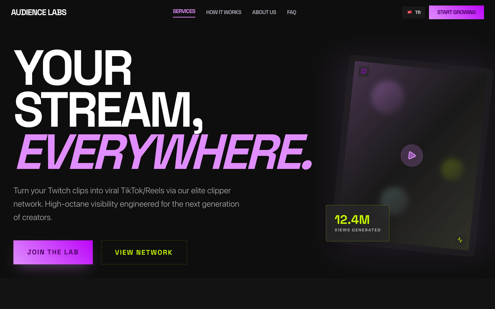
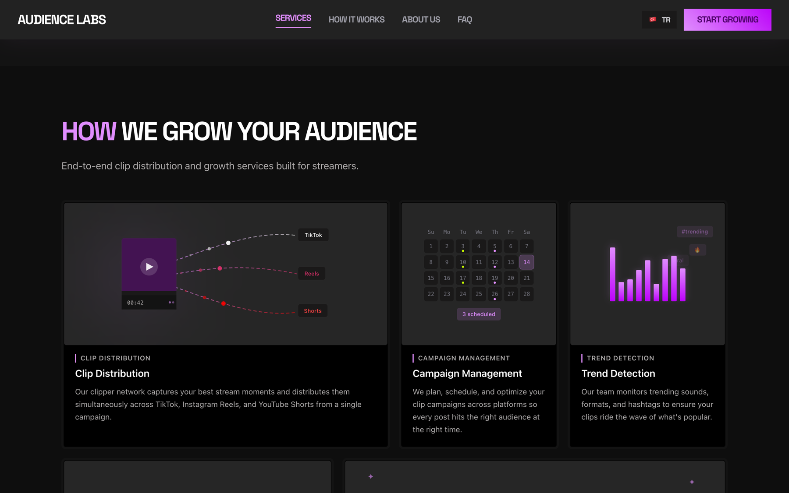
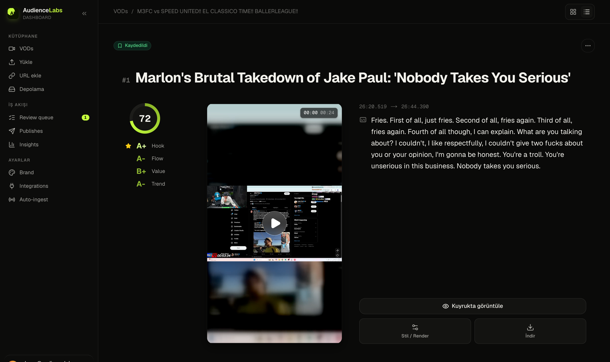

# Audience Labs, landing page

Marketing site for Audience Labs, a clip growth service for Kick and Twitch streamers: we cut streams into vertical clips and push them to TikTok, Instagram Reels and YouTube Shorts.



## What's in it

- Next.js 16 (App Router) with React 19
- Scroll and entrance animations with Framer Motion
- English and Turkish content on `/en` and `/tr` routes, with a small middleware that picks the locale from the Accept-Language header
- WebGL background effect built with OGL
- Dark, Twitch-adjacent visual style



## The product behind it

The actual platform is a separate app (private repo while it heads to launch). It takes a Twitch or Kick VOD URL, transcribes it with Whisper on GPU, has an LLM find and score the moments worth clipping, then renders vertical clips with word-level captions and schedules them for publishing. Next.js dashboard, Python worker (yt-dlp, FFmpeg, faster-whisper), Supabase for data and realtime.



## Running locally

```bash
git clone https://github.com/kaankuzu1/growthlanding.git
cd growthlanding
npm install
npm run dev
```

Then open http://localhost:3000. The middleware redirects to `/en` or `/tr` based on your browser language.
